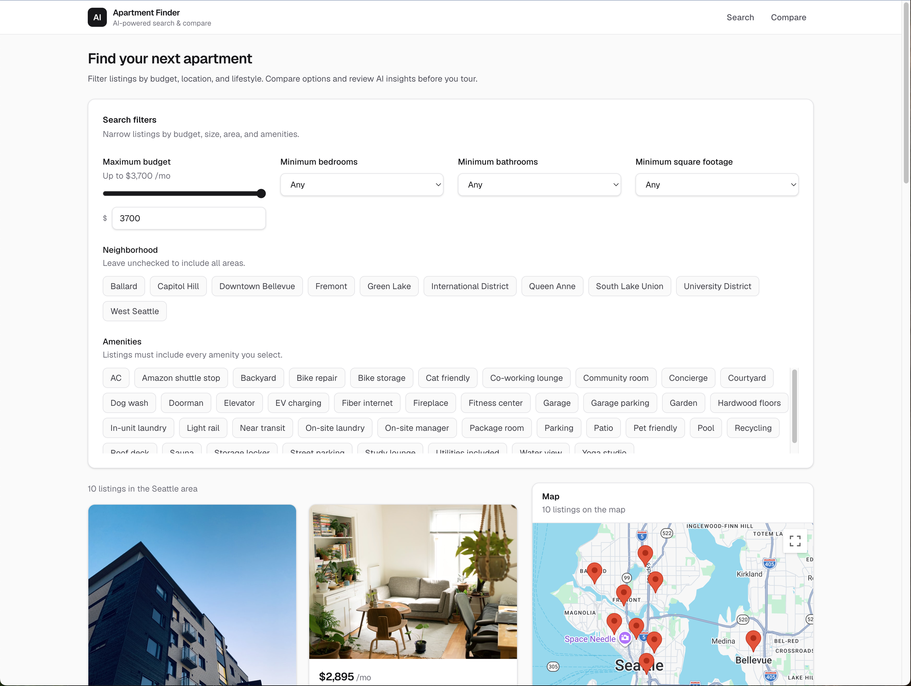
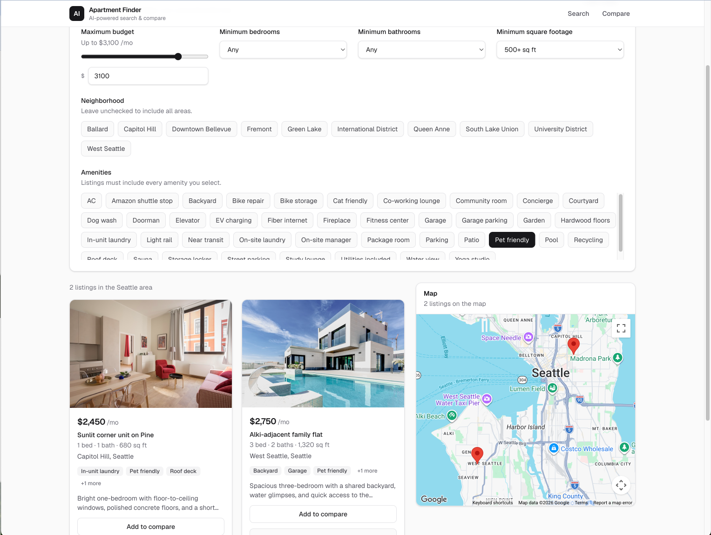
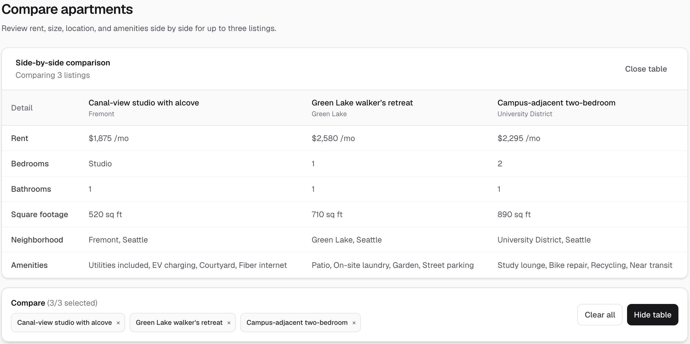
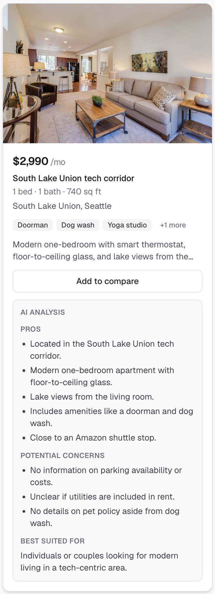

# AI Apartment Finder

A Next.js dashboard for browsing apartment listings with filtering, side-by-side comparison, map visualization, and on-demand AI listing analysis.

**[Live Demo](https://ai-apartment-finder-nine.vercel.app/)**

## Overview

Apartment searching often means switching between listing sites, maps, notes, and comparison spreadsheets. This project brings those steps into one workflow: filter listings, view them on a map, compare up to three options, and request AI-generated pros, concerns, and fit guidance from the listing data already in the database.

The current inventory is seeded demo data (Seattle-area sample listings), not live marketplace ingestion.

## Features

- **Filtering** — Narrow listings by max budget, minimum bedrooms, minimum bathrooms, minimum square footage, neighborhood, and amenities (all selected amenities must be present).
- **Listing cards** — Each card shows rent, bed/bath count, square footage, neighborhood, amenities, description, and listing image.
- **Comparison** — Select up to three apartments and compare rent, size, location, and amenities side by side.
- **Google Maps** — Interactive map with markers for the currently filtered listings; marker info windows show key listing details.
- **On-demand AI analysis** — Generate listing-specific pros, potential concerns, and renter-fit guidance on request.
- **Structured AI output** — Pros, potential concerns, and a “best suited for” summary, parsed and validated before display.
- **Concerns empty state** — When the model returns no supported concerns, the UI still shows the section with a neutral message rather than hiding it.

There are no user accounts, saved searches, persistent preference profiles, or live third-party listing feeds in the current codebase.

## Screenshots

### Dashboard

Browse apartment listings alongside an interactive map.



### Filtering

Narrow listings by budget, bedrooms, bathrooms, square footage, neighborhood, and amenities. The apartment list and map update to reflect the selected filters.



### Comparison

Select up to three apartments and compare key details side by side.



### AI Analysis

Generate on-demand, listing-grounded pros, potential concerns, and renter-fit guidance.



## Tech Stack

Verified from `package.json` and application code:

| Layer | Technology |
| --- | --- |
| Framework | [Next.js](https://nextjs.org/) 16 (App Router) |
| UI | [React](https://react.dev/) 19, [Tailwind CSS](https://tailwindcss.com/) 4 |
| Language | [TypeScript](https://www.typescriptlang.org/) |
| Database ORM | [Prisma](https://www.prisma.io/) 6 |
| Database | PostgreSQL hosted on [Supabase](https://supabase.com/) |
| AI | [OpenAI API](https://platform.openai.com/) (`gpt-4o-mini`, Responses API) |
| Maps | [Google Maps JavaScript API](https://developers.google.com/maps/documentation/javascript) via `@googlemaps/js-api-loader` |
| Testing | [Vitest](https://vitest.dev/) |
| Deployment | [Vercel](https://vercel.com/) |

## Architecture

The app is a Next.js full-stack application: React client components for the dashboard UI, Route Handlers for API endpoints, and Prisma for database access.

```
                         ┌─────────────────────┐
                         │   Google Maps API   │
                         └──────────▲──────────┘
                                    │
┌──────────────┐        ┌───────────┴──────────┐
│   Browser    │───────▶│       Next.js        │
│              │        │ UI + API Routes      │
└──────────────┘        └──────┬─────────┬─────┘
                               │         │
                         Prisma│         │server-side
                               ▼         ▼
                         ┌──────────┐ ┌──────────┐
                         │ Supabase │ │ OpenAI   │
                         │ Postgres │ │ API      │
                         └──────────┘ └──────────┘
```

**Data flow**

1. Listings are loaded with `GET /api/apartments` → Prisma → PostgreSQL.
2. Filters and comparison run in the browser against the fetched listing set.
3. The map receives the filtered apartment array and renders markers for those coordinates.
4. AI analysis is triggered with `POST /api/apartments/[id]/analyze` using only the apartment ID.

## AI Analysis Flow

The analysis path is designed to keep secrets off the client and to ground responses in trusted server-side listing data.

1. The user clicks **Analyze with AI** on a listing card.
2. The browser sends a `POST` request with the apartment **ID only** — not arbitrary listing JSON from the client.
3. The API route validates the ID format (`isValidApartmentId`).
4. The server loads the apartment record from PostgreSQL through Prisma.
5. Selected listing fields (title, address, rent, beds, baths, amenities, description, etc.) are sent to OpenAI with explicit instructions.
6. The model response is parsed and validated (`parseApartmentAnalysisJson`) before being returned as JSON.
7. The UI renders **Pros**, **Potential concerns**, and **Best suited for**.

Prompt rules require the model to use only facts from the provided listing JSON, allow “not specified in the listing” gaps as concerns when appropriate, and avoid inventing commute times, safety claims, or amenities. Parsing and prompt constraints reduce risk but do not guarantee the model will never produce an unsupported statement.

OpenAI calls run only on the server. The API key is never exposed to the browser.

## Local Setup

```bash
git clone https://github.com/aaliyahjv/ai-apartment-finder.git
cd ai-apartment-finder
npm install
```

Create a `.env.local` file with the variables listed below.

Apply the existing database migrations and seed the demo listings:

```bash
npx prisma migrate deploy
npm run db:seed
```

Start the development server:

```bash
npm run dev
```

Open [http://localhost:3000](http://localhost:3000).

Other useful database commands from `package.json`:

- `npm run db:migrate` — create and apply schema migrations during local development
- `npm run db:generate` — regenerate Prisma Client
- `npm run db:studio` — open Prisma Studio

`postinstall` runs `prisma generate` automatically after `npm install`.

## Environment Variables

Variable names only — use your own values; never commit secrets.

```env
DATABASE_URL=your_postgresql_connection_string
OPENAI_API_KEY=your_openai_api_key
NEXT_PUBLIC_GOOGLE_MAPS_API_KEY=your_google_maps_api_key
```

| Variable | Purpose |
| --- | --- |
| `DATABASE_URL` | PostgreSQL connection string for Prisma |
| `OPENAI_API_KEY` | Server-side OpenAI authentication for analysis |
| `NEXT_PUBLIC_GOOGLE_MAPS_API_KEY` | Client-side Google Maps JavaScript API key |

## Database

PostgreSQL stores apartment listings. The production database is hosted on Supabase and accessed through Prisma.

The `Apartment` model includes title, address, neighborhood, city, state, zip code, rent, bedrooms, bathrooms, square footage, amenities, description, image URL, and coordinates.

**Seed workflow**

Demo listings live in `data/mock-apartments.ts` (10 Seattle-area sample apartments). The seed script upserts them into the database:

```bash
npm run db:seed
```

This is static demo inventory, not a live apartment marketplace feed.

## Testing

Unit tests use Vitest and focus on core logic without live OpenAI calls.

| Suite | File | Coverage |
| --- | --- | --- |
| Apartment ID validation | `lib/apartment-id.test.ts` | Valid/invalid ID formats and length limits |
| Apartment filtering | `lib/filter-apartments.test.ts` | Budget, beds, baths, square footage, neighborhood, amenities, and combined filters |
| AI response parsing | `lib/parse-apartment-analysis.test.ts` | Valid JSON, fenced code blocks, empty concerns array, malformed responses, non-string list filtering |

```bash
npm test
```

Additional verification:

```bash
npm run lint
npm run build
```

## Deployment

The Next.js application is deployed on Vercel. Production uses Supabase PostgreSQL via `DATABASE_URL`, plus `OPENAI_API_KEY` and `NEXT_PUBLIC_GOOGLE_MAPS_API_KEY` configured in the Vercel project environment.

Prisma Client generation is handled by the `postinstall` script (`prisma generate`). Existing migrations can be applied to the production database with `npx prisma migrate deploy`.

## Current Limitations

- **Demo inventory** — Listings come from seeded mock data, not live marketplace APIs.
- **No authentication** — No user accounts or protected routes.
- **No persistent preferences** — Filter state resets on refresh; there are no saved searches or renter profiles.
- **Non-persistent AI cache** — Successful analyses are cached client-side to avoid duplicate requests, but the cache resets on page refresh.
- **Listing-bound AI** — Analysis quality depends on fields stored on each apartment record; missing policies or amenities may only appear as “not specified” concerns.

## Future Improvements

Possible next steps (not implemented today):

- Live listing ingestion from rental marketplace APIs or feeds
- Authentication and saved apartment lists
- Persistent renter preference profiles
- Richer, preference-aware AI analysis
- Broader test coverage (API routes, UI components, end-to-end flows)
